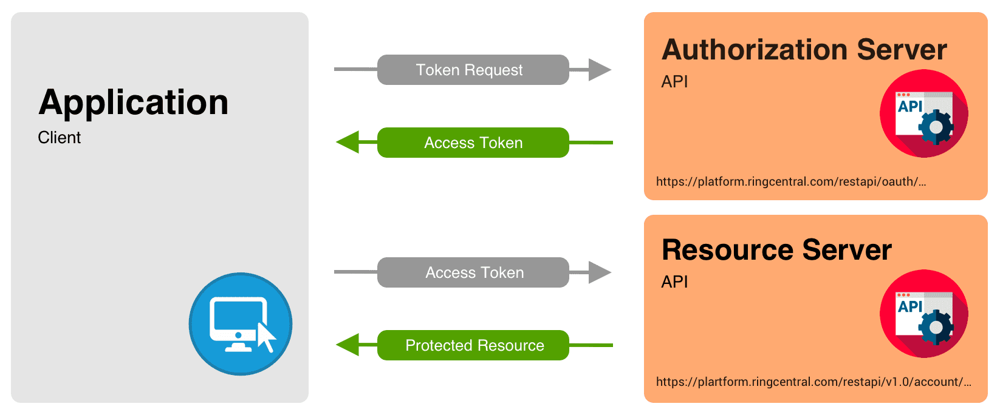

# 🧾 Frugal U API Documentation<a id="fu"></a>

## Introduction
Welcome to the official API documentation for **Frugal U**, a mobile-first budgeting app built to help college students take control of their finances.

APIs can hard to understand and implement even for devs who have been working with APIs for over a decade. You've probably used APIs and not even realized it. Everytime you go onto a website like [Youtube](https://www.youtube.com/) or [Google](https://www.google.com/) you're using an API to load that web page. If you've ever gotten a 404 page error when you try to connect to a page, that's actually a common error code for APIs everywhere. So, before we get into how to use Frugal U's Resources API, let's talk about what an API actually is.

<h2>If you're already well versed on APIs Click "Overview of the API" on the sidebar to jump to the first section of this documentation.<h2>


### **What is an API?**

An [API](https://en.wikipedia.org/wiki/API) or a (Application Programming Interface) is essentially a set of rules or protocols that allow different software systems or applications to communicate with each other. It defines the methods and data formats that the systems can use to request and exchange information. You can think of it like a waiter at a restaurant: the waiter takes your order (request) and brings it to the kitchen (the system), which processes it (action) and brings the food back (response).

### **An API typically includes**

**Endpoints** : *The specific routes that you can make requests to*.
 > For Example /api/financial-resources

 **Methods**  : *The type of request you make (GET, POST, PUT, DELETE, etc.).*
> For Example: GET /api/financial-resources

**Parameters**  : *Extra data that is included in a request (e.g., IDs, filters).*

> In /api/financial-resources?populate=SitePicture'; "populate" is the parameter.

**Responses**  : *The data that comes back after making a request, often in [JSON](https://en.wikipedia.org/wiki/JSON) or [XML](https://en.wikipedia.org/wiki/XML) format.*
  <br></br>

  **Take *this* piece of JSON code**


 ```json
{
    "data": {
        "id": 17,
        "attributes": {
            "Title": "How to Save Money as a Student",
            "Link": "https://example.com/financial-tips",
            "Category": "Financial Advice",
            "Description": "Learn strategies to save money while in school.",
            "createdAt": "2025-04-24T17:52:21.904Z",
            "updatedAt": "2025-04-24T17:52:21.904Z",
            "publishedAt": "2025-04-24T17:52:21.899Z"
        }
    },
    "meta": {}
}
 ```
  *The above code shows the response of a 'Post' method at this endpoint* **/api/financial-resources** 

The purpose of an API is to enable one system to access the functionality or data of another system in a way that is standardized and consistent. 
APIs can be used for:

**Accessing web service**s (e.g., getting weather data or social media posts).

**Interacting with a database** (e.g., querying or adding records).

**Connecting different software components** (e.g., a front-end web app interacting with a back-end server).


---
<!-- Grey card-style Table of Contents block -->
<div style="
  background-color: #f5f5f5;
  padding: 40px;
  border-radius: 30px;
  width: 95%;
  max-width: 1000px;
  margin: 0 auto 30px auto;
  text-align: center;
  box-sizing: border-box;
">

  <h2 style="margin-top: 0;">📑 <span style="color:#3f51b5;">Table of Contents</span></h2>
  <p><em>Quick access to all major sections of this documentation:</em></p>

  <ul style="list-style: none; padding: 0; line-height: 2;">
  <li><a href="#/?id=overview-of-the-api" class="toc-link">🧠 Overview of the API</a></li>
  <li><a href="#/?id=authentication-authorization" class="toc-link">🔐 Authentication & Authorization</a></li>
  <li><a href="#/?id=endpoints-parameters" class="toc-link">🧭 Endpoints & Parameters</a></li>
  <li><a href="#/?id=request-response-examples" class="toc-link">📬 Request & Response Examples</a></li>
  <li><a href="#/?id=ercd" class="toc-link">🚫 Error Codes & Rate Limiting</a></li>
  <li><a href="#/?id=change" class="toc-link">📨 Changelog & Support</a></li>
</ul>

</div>

<!-- Hover effect for TOC links -->
<style>
  .toc-link {
    text-decoration: none;
    color: black;
    font-weight: bold;
    transition: all 0.3s;
  }
  .toc-link:hover {
    color: #3f51b5;
    transform: translateX(5px);
  }
</style>


## 🧠 Overview of the API <a id="overview-of-the-api"></a>
There are many APIs in this application, however, this piece of documentation will go over one very important API. This API controls one of the main sections of Frugal U, the "Resources" tab. 

### **What is the Resources API?** 

The Resources API powers one of the core features of the Frugal U mobile application: the “Resources” tab. This tab serves as a hub for users seeking actionable financial and budgeting advice. Within this section, users can navigate to two distinct categories—Financial Advice and Budgeting Advice—each populated with curated content designed to guide users toward smarter money management. The app uses a stack navigator to direct users to these two sections, where they are presented with a scrollable list of articles containing titles, descriptions, and thumbnail images. Each article is clickable, redirecting the user to an external link for more in-depth guidance.


*Resources API in Frugal U* 

### **Behind the Scenes** 
Behind the scenes, this dynamic content is made possible through integration with [**Strapi**](https://strapi.io/), an open-source headless CMS that enables you to easily manage and serve structured content via *RESTful APIs.* In this case, the Financial and Budgeting articles are part of a shared collection type *(financial-resources)*, which is queried from Strapi based on its Category field. When users open either tab, the app sends a [GET](https://rapidapi.com/blog/api-glossary/get/) request to the Strapi backend, filtering for entries where the category matches the selected type. The response, returned in JSON format, includes structured fields like Title, Description, Link, and SitePicture, which are then rendered in the React Native UI. The use of the **populate=SitePicture** [query parameter](https://rapidapi.com/blog/api-glossary/parameters/query/) ensures that image URLs are included in the response, allowing thumbnail previews to be shown next to each article. This approach offers a clean and scalable solution for managing educational content within the app.


*Strapi Administative Home Page*

### **Learning Curve and Video Demo** 
This API maintains a simple structure, making it ideal for beginners. It doesn't have a lot of relevant end points, very few parameters and a very rudimentary structure. Whether you're a dev that's never touched APIs before or a technical writer trying to understand the basics of APIs, this API will be a great place to start and learn the basics of how an API works in practice. This leads to one of the key questions before all of the endpoints and parameters are discussed: Authentication and Authorization.


**Below is a video of the API in action in the client's budget app.**

<video controls autoplay muted loop width="100%">
  <source src="./APIPnV/resources-api-demo.mp4" type="video/mp4">
  Your browser does not support the video tag.
</video>


*Figure 4: A walkthrough showing the Resources tab in action inside the app.*

---

## 🔐 Authentication & Authorization <a id="authentication-authorization"></a> 

Before diving into [endpoints](https://blog.postman.com/what-is-an-api-endpoint/) and [query parameters](https://rapidapi.com/blog/api-glossary/parameters/query/), it’s important to cover a foundational concept in API usage—authentication and authorization. These are security-related mechanisms that protect APIs from unauthorized access and misuse. But don't worry! For the Resources API in Frugal U, things are kept intentionally simple to make onboarding and development easier. Let’s break it down.


*Figure 1. showing Authentication vs Authorization.*


### What’s the Difference?


**Authentication** is the process of verifying who you are. In many APIs, this is done using login credentials or tokens.

**Authorization** determines what you're allowed to do once you're authenticated. For example, are you allowed to update content, delete it, or only view it?

**In short:**


*Figure 2. Authentication vs Authorization Diagram*

<br>

</br>

### **How This API Handles It**
<!-- Grey card-style block with bold heading --> 

 <strong>The Resources API doesn't require authentication or authorization to access its content.</strong> 


The Resources tab is *read-only* and *public*. The content (articles, thumbnails, external links) is meant to be accessed freely by anyone using the app, without requiring a login. Since there are no create, update, or delete operations involved on the client side, there’s no risk of a user altering the database. This makes it an ideal learning example. You don’t have to worry about getting a token or dealing with permission errors—just send a GET request and receive structured content.


<!-- Add screenshot: Example of a successful unauthenticated GET request in Postman or curl – annotate with "No token required" -->


### **What If It Did Require Authentication?**
If this API were locked behind an authentication wall (for example, only admins can post new resources), you’d typically use a [JWT](https://jwt.is/) or a (JSON Web Token) in the request headers to prove your identity.

A common example might look like this:


> GET /api/financial-resources?populate=SitePicture Authorization: Bearer <your-jwt-token>


*But again—you won’t need that here.*

Learn more about JWT [here](https://jwt.io/introduction)



*How the JWT token process works*

<!-- Add picture: JWT token layout – annotate "Header", "Payload", and "Signature" -->
🧪 Quick Summary

### **Feature	Needed for Resources API?	Why?**
Authentication	❌ Not needed	API content is public and read-only
Authorization	❌ Not needed	Users can’t modify or delete any content

Next is probably one of the most important sections for understanding how this API works ** Endpoints and Parameters** Once you understand these you'll understand how to use [Requests](https://getstream.io/glossary/api-request/) to access every relevant endpoint this API has, and come away with a deeper understanding of endpointers and parameters in practice.

---

## 🧭 Endpoints & Parameters <a id="endpoints-parameters"></a>

<!-- Grey card-style block with bold heading -->

  <strong>Financial Resources API Overview</strong><br/><br/>
  
  The Financial Resources content is managed using the /api/financial-resources endpoint. You can [fetch](https://developer.mozilla.org/en-US/docs/Web/API/Fetch_API), [update](https://beeceptor.com/docs/crud-api/), [delete](https://en.wikipedia.org/wiki/Create,_read,_update_and_delete), and [filter](https://www.logicmonitor.com/support/rest-api-basic-filters) entries. Images (thumbnails, large, medium, small) are included via SitePicture and must be populated with a **query parameter**


### ➕ **GET All Financial Resources  <a id="get-all-financial-resources"></a>**
> `GET http://localhost:1337/api/financial-resources?populate=*`

*This fetches all available entries, including nested image data. Use this as the base for reading the full dataset.*

### 🔍 **GET Filtered Financial Resources <a id="get-filtered-financial-resources"></a>**
> `GET http://localhost:1337/api/financial-resources?populate=*&filters[Category][$eq]=Financial%20Advice`

*Filters resources from the system. Only available if the user has proper permissions.*

Use query parameters to filter by category. You can also chain filters for more advanced queries. 

**Below is Javascript code to use for the API**

```js
const filteredData = result.data.filter((resource) => 
  resource.attributes.Category === 'Financial Advice'
);

```
*Example filter by title alphabetically or by category*

<br></br>

 ### **UPDATE an Existing Resource**
> PUT http://localhost:1337/api/financial-resources/:id

*Updates a resource permanently from the system. Only available if the user has proper permissions. Replace :id with the unique ID of the resource you want to update.*

<br></br>


 **The JSON body should include the fields you want to modify, such as:**
 ```json

 {
  "data": {
    "Title": "Updated Title",
    "Description": "Updated description text here."
  }
}
```
<br></br>

### **DELETE an Existing Resource**

> DELETE http://localhost:1337/api/financial-resources/:id

*Removes a resource permanently from the system. Only available if the user has proper permissions.*

 ### **Sample JSON Output (Shortened)**

 ```json

 {
  "id": 1,
  "attributes": {
    "Title": "5 Financial Planning Tips for Millennials",
    "Category": "Financial Advice",
    "Link": "https://smartasset.com/financial-advisor/financial-planning-for-millennials",
    "SitePicture": {
      "data": {
        "attributes": {
          "formats": {
            "thumbnail": {
              "url": "/uploads/thumbnail_F_Pic1_26b6260518.png"
            },
            "large": {
              "url": "/uploads/large_F_Pic1_26b6260518.png"
            }
          }
        }
      }
    }*
  }
}

 ```
<br ></br>
> *Tip*: Use "/api/financial-resources?populate=*"  for full media integration. This is especially useful when displaying preview images or building card layouts from the JSON.

The next topic is going to be all relevant Requests and expected Responses for those requests. Remember Request are simply using a REST action (GET,PUT,DELETE,SEND,etc.) to access a resource and alter some piece of data the API has access too.
<br ></br>
When working with APIs, *remember* you're essentially talking to a server — asking it for data, telling it to update something, or even requesting it to delete information. This interaction is broken down into two main parts: Requests and Responses.
<br ></br>

### 📨 **What is a Request?<a id="what-is-a-request"></a>**
Think of a Request as sending a letter to a library asking for a specific book:

 **The type of letter you send (e.g., a request to borrow, return, or ask for information) is your HTTP Method (like GET, POST, PUT, or DELETE).**
**The address on the envelope is the endpoint you’re trying to reach (e.g., /api/financial-resources).**
**The details you include — like the book title or author — are your query parameters or request body, telling the library exactly what you want.**


### 📬 **What is a Response? <a id="what-is-a-response"></a>**
The Response is what the library (the API server) sends back to you:
**If the request was successful, you might get a JSON-formatted list of financial tips.**
**If something went wrong — maybe you asked for a book that doesn’t exist — you’ll get an error message with a specific status code like 404 Not Found.**

### 🔗 **How Requests Tie to Endpoints and Parameters<a id="how-requests-tie-to-endpoints-and-parameters"></a>**

**Let’s break it down Below.**

*Endpoints* are like specific departments in the library.

> "GET /api/financial-resources" *is like walking into the "Financial Resources" section.*

*Parameters* are part of the URL or body and tell the server which item you're referring to.

>"GET /api/financial-resources/3: *targets the resource with ID 3.*

*Query Parameters* refine what you're asking for.
<br ></br>

 > GET "/api/financial-resources/3:?filters[Category][$eq]=Saving" *is like saying “Only show me books in the ‘Saving’ category.”*

 

### **🧪 Understanding REST Actions Using Real World Analogies<a id="understanding-rest-actions-using-real-world-analogies"></a>**


**[GET](https://rapidapi.com/blog/api-glossary/get/)**:	Asking the librarian for a book: 	*Retrieving data*
**[POST](https://rapidapi.com/blog/api-glossary/post/)**:	Donating a new book to the library: *Adds new data*
**[PUT](https://developer.mozilla.org/en-US/docs/Web/HTTP/Reference/Methods/PUT)**:	Replacing pages in an existing book: 	*Updates existing data completely*
**[PATCH](https://developer.mozilla.org/en-US/docs/Web/HTTP/Reference/Methods/PATCH)**:	Correcting a typo in a book’s title: 	*Updates specific fields in data*
**[DELETE](https://learn.microsoft.com/en-us/rest/api/azure/devops/wiki/wikis/delete?view=azure-devops-rest-7.1)**:	Asking the librarian to remove a book:	*Removes a data entry*
<br ></br>
 *Next up*...let’s look at actual request/response examples for the Frugal U API. You’ll see how each method interacts with specific endpoints, what data is expected, and what kind of response you’ll get back from the server.
---


## 📬 Request & Response Examples <a id="request-response-examples"></a>

Now that we've explored ***endpoints**, **parameters**, and **query parameters**, it's time to see how they all come together in action through requests and responses.

**Below is a quick recap on Requests and Responses**


A **request** is a way of asking the API to either retrieve, send, update, or delete information. You do this by using HTTP methods like GET, POST, PUT, or DELETE, followed by an endpoint URL.

A **response** is the API's reply — usually in JSON format — that confirms what happened (or didn't), and returns data or an error message.

### Using a Real World Analogy For APIs <a id="rwa"></a>

**Think of the API like a restaurant:**

The **endpoint** is the menu item you're ordering.

The **Parameters** are special instructions (e.g., “no pickles”).

The **request** is the order you give the waiter.

The **response** is what comes back from the kitchen.


### **Diving Deeper Into What Request and Responses Are**<a id="dd"></a>

At the heart of every interaction with a RESTful API are requests and responses — a two-way conversation between a client (like a browser or app) and a server. A request is the action initiated by the client to access or modify a resource — such as asking for budgeting tips, submitting new expenses, or updating a user's profile. This is done using standard HTTP methods like GET, POST, PUT, or DELETE. Each request targets a specific endpoint, and may include additional details like parameters, query strings, or authentication tokens. In response, the API server returns structured data (usually in JSON format) along with a status code that communicates whether the request succeeded, failed, or needs further input. JSON, short for JavaScript Object Notation, is a lightweight data format that’s easy to read and ideal for web-based applications. Some legacy systems may still use XML, but JSON is by far the modern standard.


*Figure 2: This is where financial resources are entered in Strapi CMS.*

Understanding the distinction between public and private requests is essential. Public requests, like viewing general budgeting resources, do not require any form of login or token — they’re open to all users. Private requests, however, access or manipulate user-specific data (like creating or deleting expenses), and therefore require a JWT (JSON Web Token). This token serves as a digital ID, verifying the user's identity and granting access only to authorized resources. APIs often return different responses based on whether the request includes a valid token or not. For instance, accessing /user/expenses without authentication might result in a 401 Unauthorized error, whereas a request with the correct JWT would return the user's full expense history. This section will walk through several examples of both public and private requests and responses, followed by a breakdown of the meaning behind common status codes and the concept of rate limiting — a mechanism used to control how often a client can hit the API to prevent abuse.

Let's take a look at some examples of this...

### First Example


**Public GET Request – Fetch All Financial Resources**
> GET /api/financial-resources?populate=SitePicture
*This public request retrieves all financial resources, including the attached site images. No authentication is required.*

 **JSON Response:**

 ```json
{
  "data": [
    {
      "id": 1,
      "attributes": {
        "Title": "Budgeting Tips for College Students",
        "Description": "Simple ways to manage money as a student.",
        "Link": "https://example.com/budgeting-tips",
        "Category": "Budgeting",
        "SitePicture": {
          "data": {
            "id": 7,
            "attributes": {
              "formats": {
                "thumbnail": {
                  "url": "/uploads/budget_thumb.jpg"
                }
              }
            }
          }
        }
      }
    }
  ],
  "meta": { "pagination": { "page": 1, "pageSize": 25, "pageCount": 1, "total": 1 } }
}
 

 ```
 *You're successfully retrieving an array of articles. Each contains Title, Description, Category, and a thumbnail URL for images stored on the server.*

### Second Example
 **Filtered GET Request – Only Budgeting Articles**

 > GET /api/financial-resources?filters[Category][$eq]=Budgeting&populate=SitePicture

*This request filters for only articles in the “Budgeting” category.*

  **JSON Response**

 ```json
 {
  "data": [
    {
      "id": 2,
      "attributes": {
        "Title": "How to Save Money with Envelopes",
        "Description": "Learn the envelope budgeting method.",
        "Link": "https://example.com/envelope-method",
        "Category": "Budgeting",
        "SitePicture": {
          "data": {
            "attributes": {
              "formats": {
                "thumbnail": {
                  "url": "/uploads/envelope.jpg"
                }
              }
            }
          }
        }
      }
    }
  ]
}

 ```
*The API returned only resources where Category = Budgeting. This is useful when dynamically populating sections in the app.*

### Third Example
**Private POST Request – Create New Financial Resource (Requires JWT)**

> POST /api/financial-resources Authorization: Bearer <JWT_TOKEN> Content-Type: application/json

*Notice how a token is needed to do a Post Request*
<br></br>

 **JSON BODY**

 ```json

 {
  "data": {
    "Title": "10 Free Budgeting Tools for Students",
    "Description": "A roundup of apps to manage your money.",
    "Link": "https://example.com/free-tools",
    "Category": "Budgeting"
  }
}

 ```
*Posting a New Entry to the Strapi content server*
<br></br>
<br></br>

**JSON RESPONSE**

 ```json
{
  "data": {
    "id": 6,
    "attributes": {
      "Title": "10 Free Budgeting Tools for Students",
      "Description": "A roundup of apps to manage your money.",
      "Link": "https://example.com/free-tools",
      "Category": "Budgeting",
      "createdAt": "2025-04-24T18:20:35.000Z"
    }
  }
}


 ```
 *🔒 JWT Required:*

**Yes — this is a private request. Without a valid token, the server will return:**


 ```json

{
  "error": {
    "status": 401,
    "message": "Missing or invalid authentication token."
  }
}

  ```
### Fourth Example
**PUT Request – Update Existing Resource (Requires JWT)**

> PUT /api/financial-resources/6 Authorization: Bearer <JWT_TOKEN> Content-Type: application/json

**JSON BODY**

```json

{
  "data": {
    "Title": "Updated Budgeting Tools for 2025"
  }
}

```
*Here the user is updating the title of the sixth entry in the strapi **CMS** .*
**JSON Response:**

 ```json
{
  "data": {
    "id": 6,
    "attributes": {
      "Title": "Updated Budgeting Tools for 2025",
      "Description": "A roundup of apps to manage your money.",
      "Link": "https://example.com/free-tools",
      "Category": "Budgeting"
    }
  }
}

 ```
*The article title was successfully updated.*
<br></br>

### Fifth Example
**DELETE Request – Remove a Resource (Requires JWT)**

>DELETE /api/financial-resources/6 Authorization: Bearer <JWT_TOKEN>

**JSON Response:**


```json
{
  "data": {
    "id": 6
  },
  "meta": {}
}


```
*The resource with ID 6 was successfully deleted from the database.*

### **Conclusion**


| Method | Endpoint                              | Auth Required | Description               |
|--------|---------------------------------------|---------------|---------------------------|
| GET    | /api/financial-resources              | ❌ No         | Get all resources (public) |
| GET    | /api/financial-resources?filters[...] | ❌ No         | Filtered resources (public) |
| POST   | /api/financial-resources              | ✅ Yes        | Add new resource           |
| PUT    | /api/financial-resources/:id          | ✅ Yes        | Update resource            |
| DELETE | /api/financial-resources/:id          | ✅ Yes        | Delete resource            |


When working with **APIs**, understanding how the server handles errors and enforces usage limits is just as important as knowing how to send requests. Every time an API request is made, the server may respond with a [status code](https://restfulapi.net/http-status-codes/) that indicates whether the request was successful or if something went wrong. 

These status codes are crucial for developers because they provide immediate feedback about the request's outcome. Additionally, APIs often implement rate limiting to prevent abuse and ensure fair usage. Rate limits dictate how many requests a client can make in a specific period, preventing excessive load on the server. In the next section, we’ll dive into common error codes you might encounter while interacting with the API, and explore the concept of rate limiting, including how it affects your ability to interact with the server and what you can do when you hit a rate limit.


---

## 🚫 Error Codes & Rate Limiting <a id="ercd"></a>

When working with **APIs**, understanding how the server handles errors and enforces usage limits is just as important as knowing how to send requests. Every time an API request is made, the server may respond with a status code that indicates whether the request was successful or if something went wrong. These status codes are crucial for developers because they provide immediate feedback about the request's outcome. Additionally, APIs often implement rate limiting to prevent abuse and ensure fair usage. Rate limits dictate how many requests a client can make in a specific period, preventing excessive load on the server. In the next section, we’ll dive into common error codes you might encounter while interacting with the API, and explore the concept of rate limiting, including how it affects your ability to interact with the server and what you can do when you hit a rate limit.  

### ❗ Error Codes <a id="err"></a>

Error codes are standardized messages that help developers understand why a request to an API failed. Imagine mailing a letter—if it has the wrong address, the post office returns it with a specific reason. APIs work similarly. When you send a malformed request, use an incorrect token, or ask for something that doesn't exist, the server sends back an HTTP status code with a message explaining the issue. These codes range from `4xx` errors (indicating a problem on the client’s side) to `5xx` errors (indicating a problem on the server). Understanding these codes lets you fix issues quickly or program your app to respond accordingly—retrying, alerting the user, or logging the failure. For the Frugal U API, which uses **Strapi**, common errors occur when endpoints are wrong, authentication is missing, or a required query parameter like `populate` or `filter` is invalid. Below is a table of possible errors and how to avoid them.

| Status Code | Name                      | Meaning & Tips to Avoid                                 |
|-------------|---------------------------|---------------------------------------------------------|
| 200         | OK                        | Request succeeded; no issues.                          |
| 201         | Created                   | Resource successfully created; used with POST.         |
| 204         | No Content                | Action succeeded, no response body; typical on DELETE. |
| 400         | Bad Request               | Invalid JSON payload or missing fields; validate schema. |
| 401         | Unauthorized              | Missing/invalid bearer token; check auth headers.      |
| 403         | Forbidden                 | Authenticated but not authorized; check user roles.    |
| 404         | Not Found                 | Endpoint/resource doesn’t exist; verify URL.           |
| 409         | Conflict                  | Resource conflict; possibly duplicate data.            |
| 422         | Unprocessable Entity      | Data passed validation but failed business rules.      |
| 429         | Too Many Requests         | Rate limit exceeded; reduce request frequency.         |
| 500         | Internal Server Error     | Server-side issue; try again later or contact support. |


*Figure 1.* Example of a JSON error response showing status, message, and details in Postman.


You've probably seen at least one error code and not realized it was from an API. The most popular one is probably error code 404 or 500.


*Figure 2* Example of 404 error in a familiar setting, this is a common error you'll see on Google.

---

### ⏱️ Rate Limiting<a id="rl"></a>

[Rate limiting](https://www.cloudflare.com/learning/bots/what-is-rate-limiting/#:~:text=Rate%20limiting%20is%20a%20strategy,reduce%20strain%20on%20web%20servers.) is like a speed limit sign on a highway—it ensures no one user floods the server with too many requests too quickly. It protects APIs from abuse and ensures fair usage across all clients. Typically, it’s defined as “X requests per Y seconds,” and when exceeded, the server returns a `429 Too Many Requests` error. Rate limiting often includes headers like `Retry-After` to let clients know when to try again. As of now, the **Frugal U API**, built on the free version of **Strapi**, does not enforce rate limits by default. That said, if the app scales to higher traffic or if it's hosted on a platform like Heroku or deployed with middleware (e.g., NGINX), rate limiting can be introduced at the infrastructure level. For most developers interacting with this API, there's no need to worry about being throttled—but if you start seeing unexpected `429` responses, investigate your deployment or hosting platform.


*Figure 3.* Visual example of request volume exceeding a configured rate limit, triggering 429 errors.


Error codes help you understand how to better debug your API, whether you're a developer who has used API for a decade or two or a complete beginner, error codes are always useful. If you're an API developer, the more details and description you give when your API returns a Status Code the better it'll be for the next dev or technical writer to understand what's going on.


---


## 📨 Conclusion <a id="change"></a>

Currently this API hasn't been updated by the creator, it only has one version. Luckily, that's what makes it so simple and easy to understand.

If you're new to APIs using a simple API like this to understand how they work is a blessing. The most intricate the API is, the higher the learning curve, thus discouraging future devs from understanding APIs at the start. It would be like learning about math by taking Calculus I instead of arithmetic, it's painful and a waste of time. This API is simplistic enough to where it's easy to understand but complex enough to where it has enough relevant endpoints to document and is public to where anyone can get any information using a tool like curl or Postman.


📧 **Email:** support@frugal-u.com  


---


---
